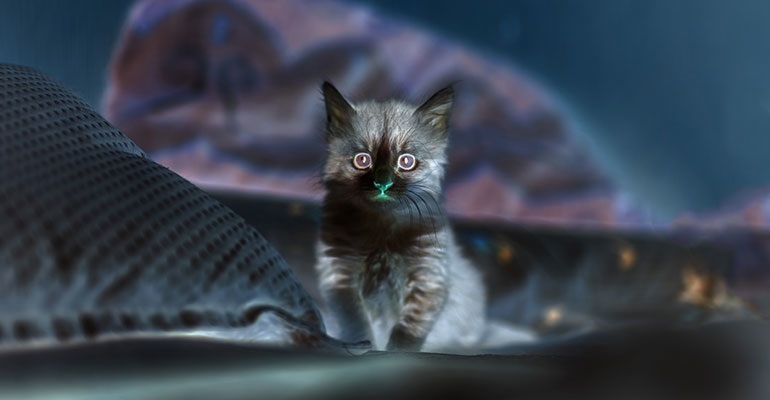

# C-Based Command-Line Image Processor

## Project Summary

This project is a command-line image processing tool written entirely in **C**. It reads a source image in the PPM (P6) format, applies a specified transformation, and saves the result as a new PPM file. The program is built to be efficient, handling binary file I/O and dynamic memory allocation. It is designed to be memory-safe, ensuring all allocated memory is properly freed (verified with Valgrind).

The tool supports several common image manipulations, which are executed via simple command-line arguments.

---

## Image Manipulation Examples

Below are examples of the transformations this program can perform.

### Original Image

(This is the image used as the input for all operations below)


### Supported Transformations

Here are 5 operations applied to the original image, shown side-by-side.

|                       Invert                        |                      Zoom-Out                      |                     Gaussian Blur                     |                         Binarize                          |                        Pointillism                         |
| :----------------------------------------------------: | :-----------------------------------------------------: | :---------------------------------------------------: | :-------------------------------------------------------: | :--------------------------------------------------------: |
|  |         |           |       |  |
| **Command:** <br> `./project in.ppm out.ppm grayscale` | **Command:** <br> `./project in.ppm out.ppm rotate-ccw` | **Command:** <br> `./project in.ppm out.ppm blur 3.0` | **Command:** <br> `./project in.ppm out.ppm saturate 1.8` |  **Command:** <br> `./project in.ppm out.ppm pointilism`   |

---

## How to Use

### 1. Compile

Run `make` to build the executable:

```bash
make
```

### 2. Run

Use the following syntax to run the program:

```bash
./project <input-file.ppm> <output-file.ppm> <operation> [operation-arguments]
```

**Operations:**

- `grayscale`
- `rotate-ccw`
- `pointilism`
- `blur <sigma_value>`
- `saturate <scale_factor>`
- `blend <image2.ppm> <alpha_factor>`

